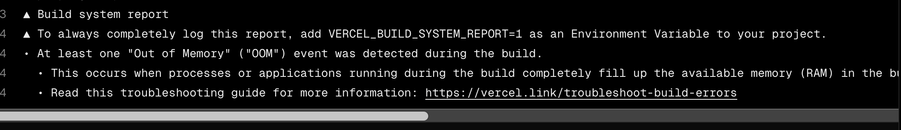

# Documentation Chat Bot

## Project Overview

A sophisticated Telegram bot that implements Retrieval-Augmented Generation (RAG) to provide intelligent answers based on uploaded PDF documents.

###  Key Features
- **PDF Document Processing**: Upload and process PDF files of various sizes
- **Intelligent Q&A**: Ask questions about uploaded documents and get accurate answers
- **Vector Search**: Uses ChromaDB for efficient similarity search
- **Multi-document Support**: Maintain knowledge base across multiple PDFs
- **Admin Controls**: Special commands for bot management and monitoring

### Demo
 *Add your GIF here showing:*
- *Ask question according Python doc*
- *Call for admin rights*
- *Become admin*
- *Upload a PDF documents*
- *See the list od docs*
- *Rebuild index for a vector search*
- *Ask questions about the content*
- *Receiving accurate answers*
- *Delete admin*

##  Project Structure

```
telegram-rag-bot/
├── api/
│   ├── __init__.py
│   └── bot.py                    # Vercel serverless function handler
├── bot/
│   ├── __init__.py
│   ├── telegram_bot.py           # Main bot initialization
│   ├── admin_handlers.py         # Admin commands and controls
│   ├── user_handlers.py          # User interaction handlers
│   ├── keyboards.py              # Telegram inline keyboards
├── rag/
│   ├── __init__.py
│   ├── config.py                 # RAG configuration (paths, models)
│   ├── build_vectorstore.py      # PDF processing and vector store creation
│   ├── global_rag.py             # File for the import usage
│   └── rag_pipeline.py           # Core RAG logic and query processing
├── data/
│   └── documents/                # Uploaded PDF storage
├── requirements.txt              # Python dependencies
├── runtime.txt                   # Python version
├── vercel.json                   # Vercel deployment configuration
├── set_webhook.py                # Telegram webhook setup utility
└── README.md                    
```

## Quick Start

### Prerequisites
- Python 3.10+
- Telegram Bot Token (from [@BotFather](https://t.me/botfather))
- Google Gemini API Key
- Git

### Installation

1. **Clone the repository**
```bash
git clone https://github.com/yourusername/telegram-rag-bot.git
cd telegram-rag-bot
```

2. **Create virtual environment and install dependencies**
```bash
python -m venv venv
source venv/bin/activate  # On Windows: venv\Scripts\activate
pip install -r requirements.txt
```

3. **Configure environment variables**
```bash
cp .env.example .env
# Edit .env with your credentials:
# TG_TOKEN=your_telegram_bot_token
# ADMIN_ID=your_telegram_id
# GEMINI_API_KEY=your_google_gemini_key
```

4. **Run the bot locally**
```bash
python -m bot.telegram_bot
```

### Bot Commands
- `/start` - Welcome message 
- `/admin` - Display all admin features

## Technical Details

### Core Components

#### 1. **Document Processing Pipeline**
- **PDF Extraction**: Uses PyMuPDF for efficient text extraction
- **Text Chunking**: Implements recursive text splitting with overlap
- **Embedding Generation**: Sentence Transformers create vector representations
- **Vector Storage**: ChromaDB for fast similarity search

#### 2. **RAG Architecture**
```
User Query → Embedding → Vector Search → Context Retrieval → Gemini API → Response
```

#### 3. **Memory Requirements**
The bot requires significant resources due to ML dependencies:

| Dependency | Size | Purpose | Why Essential |
|------------|------|---------|---------------|
| **sentence-transformers** | 200MB | Text embeddings | Creates vector representations for semantic search |
| **ChromaDB** | 150MB | Vector database | Enables fast similarity search across documents |
| **PyMuPDF** | 80MB | PDF processing | Extracts text from complex PDF layouts |
| **LangChain** | 100MB | Orchestration | Manages document processing pipeline |

**Total Build Memory**: ~1.5GB  
**Runtime Memory**: ~750MB

### Why These Heavy Dependencies Are Essential

1. **Quality of Answers**: sentence-transformers provides state-of-the-art embeddings that capture semantic meaning, crucial for accurate document retrieval
2. **PDF Complexity**: PyMuPDF handles complex PDF structures (tables, columns, images) better than lightweight alternatives
3. **Search Performance**: ChromaDB enables millisecond-level similarity search across thousands of document chunks
4. **Pipeline Reliability**: LangChain provides battle-tested components for document processing and retrieval

## Deployment Challenges

### The Vercel Memory Limit Problem

Despite extensive optimization attempts, the project consistently fails deployment on free-tier hosting services:

#### What was Tried to Reduce Memory Usage:
1. ✅ **Switched from FAISS to ChromaDB** (300MB → 150MB)
2. ✅ **Replaced PyMuPDF with PyPDF** (80MB → 1MB)
3. ✅ **Implemented chunk batching** for large documents
4. ✅ **Used lightweight embedding models** (all-MiniLM-L6-v2)
5. ❌ **Cannot remove sentence-transformers** - core functionality depends on it
6. ❌ **Cannot remove ChromaDB** - vector search is essential

#### Service Limitations:

| Service | Free Tier Memory | Our Requirements | Status |
|---------|-----------------|------------------|--------|
| **Vercel** | 1GB (shared) | 1.5GB+ | ❌ **FAILS** |
| **Railway Free** | 512MB | 1.5GB+ | ❌ **INSUFFICIENT** |
| **Render Free** | 512MB | 1.5GB+ | ❌ **INSUFFICIENT** |
| **Koyeb Free** | 512MB | 1.5GB+ | ❌ **INSUFFICIENT** |

### Error Evidence

 *Screenshot showing:*
```
▲ Build system report
• At least one "Out of Memory" ("OOM") event was detected during the build
• This occurs when processes completely fill up the available memory (8GB)
• Build container terminates with SIGKILL signal
```

